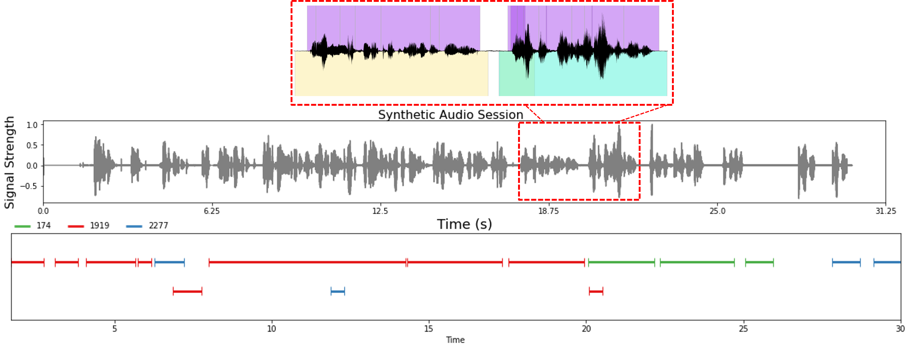

**Speech Data Simulator**
===============

Outline
------------

The speech data simulator generates synthetic multispeaker audio sessions for training or evaluating models for multispeaker ASR or speaker diarization. This tool aims to address the lack of labelled multispeaker training data and to help models deal with overlapping speech.

The simulator loads audio files from different speakers as well as forced alignments for each sentence and concatenates the audio files together to build a synthetic multispeaker audio session. The simulator uses the word alignments to segment the audio from each speaker to produce utterances of the desired length. The simulator also incorporates synthetic room impulse response (RIR) generation in order to simulate multi-microphone multispeaker sessions.

Features
------------

The simulator is reconfigurable and has several options including:

* Amount of overlapping speech 
  - The percentage of overlapping speech out of the total speaker time.
* Percentage of silence
  - The percentage of the overall audio session that has no speakers talking.
* Sentence length distribution
  - The distribution of sentence lengths that is used for sampling (the parameters passed in are for a negative binomial distribution).
* Number of speakers per session
* Length of each session
* Variance in speaker dominance 
  - Determines what portion of the speaking time will be used by each speaker in a session. Increasing this value will make it more likely that a few speakers dominate the conversation. 
* Turn taking 
  - Determines how likely it is that a speaker keeps talking after completing an utterance.
* Background noise 

The simulator can be used in two modes: near field (no Room Impulse Response) as well as far field (including synthetic RIR). When using synthetic RIR generation, multiple microphones can be placed in the simulated room environment for multichannel simulations.

The simulator also has a speaker enforcement mode which ensures that the correct number of speakers appear in each session (otherwise not guaranteed since speaker turns are stochastic). In speaker enforcement mode, the length of the session or speaker probabilities may be adjusted to ensure all speakers are present.

Required Datasets
------------

* LibriSpeech (or another single-speaker dataset)
* LibriSpeech word alignments from [here](https://github.com/CorentinJ/librispeech-alignments) (or alignments corresponding to another single-speaker dataset)

Example alignment format from the LibriSpeech dataset (to be passed as input to the `scripts/speaker_tasks/create_librispeech_alignment_manifest.py` script):

* Alignment files are stored at <Speaker ID>/<Chapter ID>/<Speaker ID>-<Chapter ID>.txt, and each line in the alignment file corresponds to a separate sentence
* Example of a line in `dev-clean/1272/128104/1272-128104.txt': '1272-128104-0000 ",MISTER,QUILTER,IS,THE,APOSTLE,OF,THE,MIDDLE,CLASSES,,AND,WE,ARE,GLAD,TO,WELCOME,HIS,GOSPEL," "0.500,0.800,1.270,1.400,1.520,2.150,2.270,2.350,2.620,3.270,3.300,3.450,3.600,3.670,4.070,4.200,4.600,4.840,5.510,5.855"`

Optional Datasets
------------

* Room Impulse Response and Noise Database from [here](https://www.openslr.org/resources/28/rirs_noises.zip) (or another background noise dataset)

Installation (after installing NeMo)
------------

Note that only one of gpuRIR or pyroomacoustics is required for RIR simulation.

```bash
pip install cmake
pip install https://github.com/DavidDiazGuerra/gpuRIR/zipball/master
pip install pyroomacoustics==0.7.7
```

Parameters
------------

* Data simulator parameters are contained in `conf/data_simulator.yaml`

Example Session
------------

Example multispeaker audio session (using LibriSpeech audio samples and word alignments). RTTM and CTM output labels are highlighted.



Running the data simulator for the LibriSpeech dataset
------------

1. Download the LibriSpeech dataset

```bash
python scripts/dataset_processing/get_librispeech_data.py \
  --data_root <path to download LibriSpeech dataset to> \
  --data_sets ALL
```

2. Download LibriSpeech alignments from [here](https://drive.google.com/file/d/1WYfgr31T-PPwMcxuAq09XZfHQO5Mw8fE/view?usp=sharing) (the base directory is the LibriSpeech-Alignments directory)

3. Create the manifest file with alignments

```bash
python <NeMo base path>/scripts/speaker_tasks/create_alignment_manifest.py \
  --input_manifest_filepath <Path to train_clean_100.json manifest file> \
  --base_alignment_path <Path to LibriSpeech_Alignments directory> \
  --output_manifest_filepath train-clean-100-align.json \
  --ctm_output_directory ./ctm_out \
  --libri_dataset_split train-clean-100
```

4. (Optional) Create the background noise manifest file

```bash
python <NeMo base path>/scripts/speaker_tasks/pathfiles_to_diarize_manifest.py \
--paths2audio_files <Path to noise list file> \
--manifest_filepath bg_noise.json
```

5. Create audio sessions (near field)

```bash
python multispeaker_simulator.py --config-path='conf' --config-name='data_simulator.yaml' \
  data_simulator.random_seed=42 \
  data_simulator.manifest_filepath=./train-clean-100-align.json \
  data_simulator.outputs.output_dir=./test \
  data_simulator.background_noise.add_bg=True \
  data_simulator.background_noise.background_manifest=./bg_noise.json
```

6. Create multi-microphone audio sessions (with synthetic RIR generation)

```bash
python multispeaker_simulator.py --config-path='conf' --config-name='data_simulator.yaml' \
  data_simulator.random_seed=42 \
  data_simulator.manifest_filepath=./train-clean-100-align.json \
  data_simulator.outputs.output_dir=./test_rir \
  data_simulator.background_noise.add_bg=True \
  data_simulator.background_noise.background_manifest=./bg_noise.json
  data_simulator.rir_generation.use_rir=True
```
