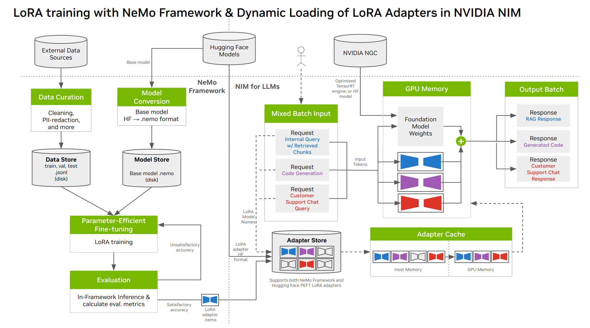

# Llama 3 LoRA fine-tuning and deployment with NeMo Framework and NVIDIA NIM

[Llama 3](https://blogs.nvidia.com/blog/meta-llama3-inference-acceleration/) is an open source large language model by Meta that delivers state-of-the-art performance on popular industry benchmarks. It has been pretrained on over 15 trillion tokens, and supports 8K context length. It is available in two sizes: 8B and 70B, and it has two variants for each size - base pretrained and instruction tuned.  

[**Low-Rank Adaptation (LoRA)**](https://arxiv.org/pdf/2106.09685) has emerged as a popular Parameter Efficient Fine-Tuning (PEFT) technique that tunes a very small number of additional parameters as compared to full fine-tuning, thereby reducing the compute required. 

[NVIDIA NeMo Framework](https://docs.nvidia.com/nemo-framework/user-guide/latest/overview.html) provides tools to perform LoRA on Llama 3 to fit your usecase, which can then be deployed using [NVIDIA NIM](https://www.nvidia.com/en-us/ai/) for optimized inference on NVIDIA GPUs. 

NIM supports seamless deployment of multiple LoRA adapters (aka "multi-LoRA") over the same base model by dynamically loading the adapter weights based on incoming requests at runtime. This allows flexibility in serving inputs belonging to different tasks or usecases without having to deploy a bespoke model for each usecase. More information on NIM for LLMs can be found it its [documentation](https://docs.nvidia.com/nim/large-language-models/latest/introduction.html).


Figure 1: Diagram representing the various steps involved in LoRA customization using NVIDIA NeMo Framework and deployment with NVIDIA NIM.

## Pre-requisites

In order to proceed, ensure that you have -
* System Configuration
    *  Access to atleast 1 NVIDIA GPU with a cumulative memory of atleast 80GB, for example: 1 x H100-80GB or 1 x A100-80GB.
    * A docker enabled environment, with [NVIDIA Container Runtime](https://developer.nvidia.com/container-runtime) installed, which will make the container GPU-aware.
    * Other pre-requisites for NIM are mentioned [here](https://docs.nvidia.com/nim/large-language-models/latest/getting-started.html#prerequisites)
    
* Requested the necessary permission from Hugging Face and Meta to download [Meta-Llama-3-8B-Instruct](https://huggingface.co/meta-llama/Meta-Llama-3-8B-Instruct). Then, you can use your Hugging Face [access token](https://huggingface.co/docs/hub/en/security-tokens) to download the model, which we will then convert and customize with NeMo Framework.

* [Authenticate with NVIDIA NGC](https://docs.nvidia.com/nim/large-language-models/latest/getting-started.html#ngc-authentication), and download [NGC CLI Tool](https://docs.nvidia.com/nim/large-language-models/latest/getting-started.html#ngc-cli-tool).


## [1. Creating a LoRA adapter with NeMo Framework](./llama3-lora-nemofw.ipynb)

This notebook showcases performing LoRA PEFT **Llama 3 8B Instruct** on [PubMedQA](https://pubmedqa.github.io/) using NeMo Framework. PubMedQA is a Question-Answering dataset for biomedical texts.


### To get started

NeMo Framework is available as a [docker container](https://catalog.ngc.nvidia.com/orgs/nvidia/containers/nemo). 

Run the container using the following command. It assumes that you have the notebook(s) available in the current working directory. If not, mount the appropriate folder to `/workspace`.

```bash
export FW_VERSION=24.05 ## Make sure to choose the latest available tag
```

```bash
docker run \
  --gpus all \
  --shm-size=2g \
  --net=host \
  --ulimit memlock=-1 \
  --rm -it \
  -v ${PWD}:/workspace \
  -w /workspace \
  -v ${PWD}/results:/results \
  nvcr.io/nvidia/nemo:$FW_VERSION bash
```

From within the container, start Jupyter lab:

```
jupyter lab --ip 0.0.0.0 --port=8888 --allow-root
```
Then, navigate to [this notebook](./llama3-lora-nemofw.ipynb).


## [2. Multi-LoRA inference with NVIDIA NIM](./llama3-lora-deploy-nim.ipynb)
This is a demonstration of deploying multiple LoRA adapters with NVIDIA NIM. NIM supports LoRA adapters in `.nemo` (from NeMo Framework), and Hugging Face model formats. We will deploy the PubMedQA LoRA adapter from Notebook 1, alongside two other already trained LoRA adapters ([GSM8K](https://github.com/openai/grade-school-math), [SQuAD](https://rajpurkar.github.io/SQuAD-explorer/)) that are available on NVIDIA NGC as examples.

`NOTE`: While it's not necessary to complete the LoRA training and obtain the adapter from the previous notebook ("Creating a LoRA adapter with NeMo Framework") to follow along with this one, it is recommended if possible. You can still learn about LoRA deployment with NIM using the other adapters downloaded from NGC.

### To get started

#### 1. Download example LoRA adapters

The following steps assume that you have authenticated with NGC and downloaded the CLI tool, as mentioned in pre-requisites.

```bash
# Set path to your LoRA model store
export LOCAL_PEFT_DIRECTORY="./loras"
mkdir -p $LOCAL_PEFT_DIRECTORY
pushd $LOCAL_PEFT_DIRECTORY


cd $LORA_MODEL_STORE
# downloading NeMo-format loras
ngc registry model download-version "nim/meta/llama3-8b-instruct-lora:nemo-math-v1"
ngc registry model download-version "nim/meta/llama3-8b-instruct-lora:nemo-squad-v1"

popd
chmod -R 777 $LOCAL_PEFT_DIRECTORY
```

#### 2. Prepare the LoRA model store
Ensure that the the LoRA model store directory has a structure like so - with the name of the model as a sub-folder that contains the .nemo file.

```
</path/to/LoRA-model-store>
├── llama3-8b-instruct-lora_vnemo-math-v1
│   └── llama3_8b_math.nemo
├── llama3-8b-instruct-lora_vnemo-squad-v1
│   └── llama3_8b_squad.nemo
└── llama3-8b-pubmed-qa
    └── megatron_gpt_peft_lora_tuning.nemo
```

The last one was just trained on the pubmedQA dataset in the previous notebook. After training is complete, that LoRA model checkpoint will be created at `./results/Meta-Llama-3-8B-Instruct/checkpoints/megatron_gpt_peft_lora_tuning.nemo`, assuming default paths in the first notebook weren't modified.

To ensure model store is organized as expected, create a folder named `llama3-8b-pubmed-qa`, and move your .nemo checkpoint there.

```bash
mkdir -p $LOCAL_PEFT_DIRECTORY/llama3-8b-pubmed-qa

# Ensure the source path is correct
cp ./results/Meta-Llama-3-8B-Instruct/checkpoints/megatron_gpt_peft_lora_tuning.nemo $LOCAL_PEFT_DIRECTORY/llama3-8b-pubmed-qa 
```

#### 3. Set-up NIM
From your host OS environment, start the NIM docker container while mounting the LoRA model store, as follows:

```bash
export NGC_API_KEY=<YOUR_NGC_API_KEY>
export LOCAL_PEFT_DIRECTORY=</path/to/LoRA-model-store>
chmod -R 777 $LOCAL_PEFT_DIRECTORY

export NIM_PEFT_SOURCE=/home/nvs/loras # Path to LoRA models internal to the container
export NIM_PEFT_REFRESH_INTERVAL=3600  # (in seconds) will check NIM_PEFT_SOURCE for newly added models in this interval
export CONTAINER_NAME=meta-llama3-8b-instruct

export NIM_CACHE_PATH=</path/to/LoRA-model-store-cache>  # Processed LoRA models will be stored here
mkdir -p $NIM_CACHE_PATH
chmod -R 777 $NIM_CACHE_PATH


docker run -it --rm --name=$CONTAINER_NAME \
    --runtime=nvidia \
    --gpus all \
    --shm-size=16GB \
    -e NGC_API_KEY \
    -e NIM_PEFT_SOURCE \
    -e NIM_PEFT_REFRESH_INTERVAL \
    -v $NIM_CACHE_PATH:/opt/nim/.cache \
    -v $LOCAL_PEFT_DIRECTORY:$NIM_PEFT_SOURCE \
    -p 8000:8000 \
    nvcr.io/nim/meta/llama3-8b-instruct:1.0.0
```
The first time you run the command, it will download the model and cache it in $NIM_CACHE_PATH so subsequent deployments are even faster.
There are several options to configure NIM other than the ones listed above, and you can find a full list in [NIM configuration](https://docs.nvidia.com/nim/large-language-models/latest/configuration.html) documentation.

#### 4. Start the notebook
From another terminal, follow the same instructions as the previous notebook to launch Jupyter Lab, and navigate to [this notebook](./llama3-lora-deploy-nim.ipynb). You may use the same NeMo Framework docker container which has Jupyter installed.